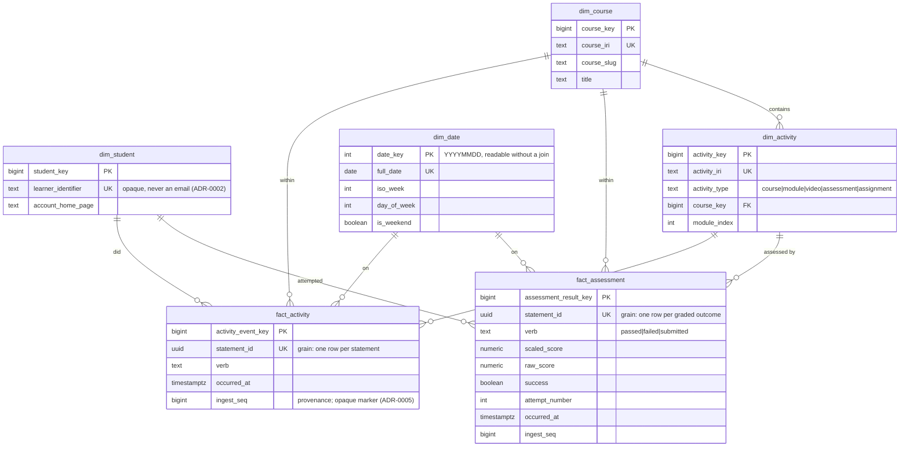

# Architecture

## System view
Sources (Moodle logstore_xapi, Articulate content, any xAPI emitter — all
simulated by data/generator in dev) → **ingestion API** (LRS-style
endpoint, validate + store raw, idempotent) → **ETL** (incremental,
re-runnable) → **warehouse** (star schema: fact_activity, fact_assessment;
dims student/course/activity/date) → **ML** (feature pipeline, risk model,
scoring job with per-learner drivers) → **LLM layer** (provider-abstracted;
summaries + NL→SQL Q&A grounded with citations) → **dashboard** (FastAPI +
React) . Deployment: Terraform, serverless-first on AWS.

## The dimensional model (M2)

Four conformed dimensions, two facts. Grain, key strategy, and the
deliberate overlap between the facts are argued in ADR-0006.

**The two facts overlap, by design.** `fact_activity` is the atomic
record and holds *every* statement, assessment events included.
`fact_assessment` holds the graded outcomes again, with their scores.

- **Behaviour and engagement questions** — how often, how recently, what
  gaps — read `fact_activity`.
- **Outcome and attainment questions** — what was scored, what was passed
  — read `fact_assessment`.
- **Never sum across both.** An assessment event is counted in each. Both
  tables carry a Postgres comment saying so, because an analyst reads
  `\d+` far more often than an ADR.

Idempotency is a schema property, not a loader promise: `statement_id` is
UNIQUE on both facts, so re-running the ETL over the same statements is
stopped by the database.

Diagram: rendered above from source, so it cannot drift silently from the
model — a test asserts every table in `pipeline.warehouse` appears here.

## Key stances (each gets a full ADR when implemented)
- Standards-based decoupling: no LMS plugins; consume xAPI emitters.
- Synthetic-only data in repo and demo (FERPA posture).
- LLM answers must cite warehouse rows/queries; unanswerable → refuse.
- Known v1 limitation: rosters/enrollment context typically live in
  SIS/LMS, not the event stream. Real deployments add a roster import.
  Documented, deliberately out of scope.
